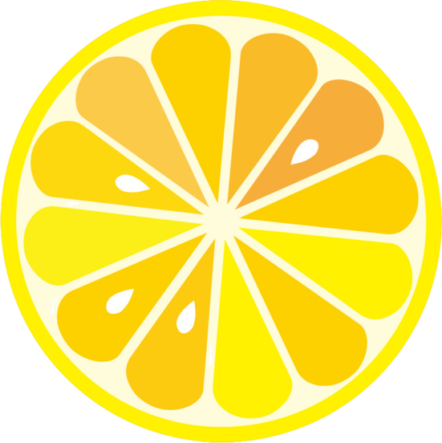

<h1 align="center">Fizz</h1>
<p align="center"></p><p align="center">Fizz is a wrapper for <strong>Gin</strong> based on <i>gadgeto/tonic</i>.</p>
<p align="center">It generates wrapping gin-compatible handlers that do all the repetitive work and wrap the call to your handlers. It can also generates an almost complete <strong>OpenAPI 3</strong> specification of your API.</p>
<p align="center"><br>
<a href="https://godoc.org/github.com/wI2L/fizz"></a> <a href="https://goreportcard.com/report/wI2L/fizz"></a> <a href="LICENSE"></a>
<br>
</p>

---

## Routing

First of all, you need to create a Fizz instance. You can pass an existing Gin engine instance to `fizz.NewFromEngine()`, or use `fizz.New()` that will use a new default Gin engine.

```go
engine := gin.Default()
engine.Use(...) // register global middlewares

fizz := fizz.NewFromEngine(engine)
```

A Fizz instance abstracts the `GET`, `POST`, `PUT`, `PATCH`, `DELETE`, `OPTIONS`, `HEAD`, and `Use` functions of a Gin engine that you use to declare routes and register middlewares.

The bare minimum to register a handler is:
```go
fizz.GET("/foo/bar", MyHandler, tonic.StatusCode(200))
```
Those functions takes optional variadics arguments using the option pattern to let you enrich the OpenAPI specification for each operation.

```go
// set the default status code used by the tonic render hook.
// Warning: this option is mandatory, will panic if missing.
tonic.StatusCode(code int)

// set the default response description.
// a default text status created from the default status code
// will be used in case its missing.
tonic.StatusDescription(desc string)

// the sumamry of the operation.
tonic.Summary(summary string)

// the description of the operation.
tonic.Description(desc string)

// mark the operation as deprecated.
tonic.Deprecated(deprecated bool)

// add an additional response to the operation.
// model and header may be `nil`.
tonic.Response(code, desc string, model interface{}, headers []*ResponseHeader)

// add an additional header to the default response.
// model may be `nil`, in which case the string type will
// be used as a default.
tonic.Header(name, desc string, model interface{})
```

You can also creates subgroups of routes using the method `Group()`. Unlike Gin own function, the Fizz method takes two other arguments `name` and `description`. These parameters will be used as an **OpenAPI** tag for all the sub-routes registered to the group.

```go
grp := fizz.Group("/subpath", "MyGroup", "Group description", middlewares...)

// The Use() method can also be used on groups to
// register middlewares after their creation.
grp.Use(moreMiddlewares...)

grp.POST("", MyPostHandler,
   tonic.StatusCode(201),
   tonic.StatusDescription("resource created"),
   tonic.Header("X-Custom-Header", "custom header", new(int)),
)

grp.GET("/:id", MyGetHandler,
   tonic.StatusCode(200),
   tonic.Summary("Get a resource by its ID"),
   tonic.Response(400, "Bad request", nil, nil),
)
```

Subgroups of subgroups can be created to an infinite depth, according yo your needs.

```go
foo := fizz.Group("/foo", "Foo", "Foo group")

// all routes registered on group bar will have
// a relative path starting with /foo/bar
bar := foo.Group("/bar", "Bar", "Bar group")

// /foo/bar/{barID}
bar.GET("/:barID", MyBarHandler, tonic.StatusCode(200))
```

Finally, to use the router as the Handler of your HTTP server, call the `Router()` on the Fizz instance.
```go
srv := &http.Server{
   Addr:    ":4242",
   Handler: fizz.Router(),
}
srv.ListenAndServe()
```

## Tonic

The subpackage **tonic** handles path/query/header/cookie/body parameters binding in a single consolidated input object which allows you to remove all the boilerplate code that retrieves and tests the presence of various parameters.

### Handler signature

The handlers registered with Fizz are automatically wrapped with Tonic, and must follow a specific signature.
```go
func(*gin.Context, [input object ptr]) ([output object], error)
```
Input and output objects are both optional, as such, the minimal accepted signature is:
```go
func(*gin.Context) error
```

Output objects can be of any type, and will be marshaled to the desired media type.
Note that the input object MUST always be a pointer to a struct, or the parameters binding will panic.

### Location tags

Tonic uses four struct tags to recognize the parameters it should bind from the input types of your objects:
- `path`: bind from the request path
- `query`: bind from the query string
- `header`: bind from the request header
- `cookie`: bind from the request cookies

The fields tgat doesn't use one those four tags will be considered as part of the request body.

The value of each struct tags represents the name of the field in each location, with options.
```go
type MyHandlerParams struct {
   ID  int64     `path:"id"`
   Foo string    `query:"foo"`
   Bar time.Time `header:"x-custom-bar"`
}
```

Tonic will automatically convert the value extracted from the location described by the tag and convert it to the appropriate type before binding.

To make a field required, you can use the `required` option in the tag value.
```go
ID  int64 `path:"id,required"`
```

**NOTE**: A path parameter is always required and will appear required in the spec regardless of the presence of the option in the tag value.

### Additional tags

You can use additional tags. Some will be interpreted by Tonic, others will be exclusively used to enrich the **OpenAPI** specification.
- `default`: Tonic will bind this value if none was passed with the request. This should not be used in cunjunction with the `required` option. [docs](https://swagger.io/docs/specification/describing-parameters/), section _Common Mistakes_ for more informations about this tag behavior.
- `description`: describe the field in the spec.
- `enum`: a coma separated list of acceptable values for the parameter. Tonic will verify that the given value is one of those.
- `format`: override the format of the field in the spec. [docs](https://github.com/OAI/OpenAPI-Specification/blob/master/versions/3.0.0.md#dataTypeFormat)
- `binding`: binding options related to the request body. [docs](https://github.com/gin-gonic/gin#model-binding-and-validation)

### Request body

If you want to make a request body field mandatory, you can use the tag `binding:"required"`. However, to explicitely ignore a parameter, use the tag `binding:"-"`.

Not that thet spec generator will ignore request body parameters for the operations with method `GET`, `DELETE` or `HEAD`.
   > GET, DELETE and HEAD are no longer allowed to have request body because it does not have defined semantics as per [RFC 7231](https://tools.ietf.org/html/rfc7231#section-4.3).
   _[Swagger Documentation](https://swagger.io/docs/specification/describing-request-body/)_

## OpenAPI specification

Fizz let you customize and enrich the generated OpenAPI specification.
When you register the route that will serve the spec, you can declare general informations about your API.
```go
infos := &openapi.Info{
   Title:       "Fruits Market",
   Description: `This is a sample Fruits market server.`,
   Version:     "1.0.0",
}
```

Head to the [OAS3 spec](https://github.com/OAI/OpenAPI-Specification/blob/master/versions/3.0.0.md#infoObject) for more informations about the API informations that you can specify, or take a look at the type `openapi.Info` in the file [_openapi/objects.go_](openapi/object.go#L25).

You can serve the spec in either `JSON` or `YAML` format.
```go
fizz.Router().GET("/openapi.json", fizz.OpenAPI(infos, "json"))
```
```go
fizz.Router().GET("/openapi.yaml", fizz.OpenAPI(infos, "yaml"))
```
**NOTE**: since the **OpenAPI** handler isn't compliant with the Tonic signature, you should use the underlying router of the Fizz instance to register this handler.

## Known limitations

- Since **OpenAPI** is based on **JSON Schema**, maps with keys that are not strings are not supported and will be ignored during the generation of the spec.
- The output types of your handlers are registered as components within the generated spec. However, the name used for each type does not take into account the package path. As such, duplicate names are not supported. Please ensure that you use unique type names across all the packages of your application.

## Examples

A simple runnable API is available in `examples/market`.
```shell
go build
./market
# Retrieve the specification marshaled in JSON.
curl -i http://localhost:48879/openapi.json | jq
```

## Credits

Fizz is based on a revised version of [gadgeto/tonic](https://github.com/loopfz/gadgeto/tree/master/tonic).

<p align="right"></p>
