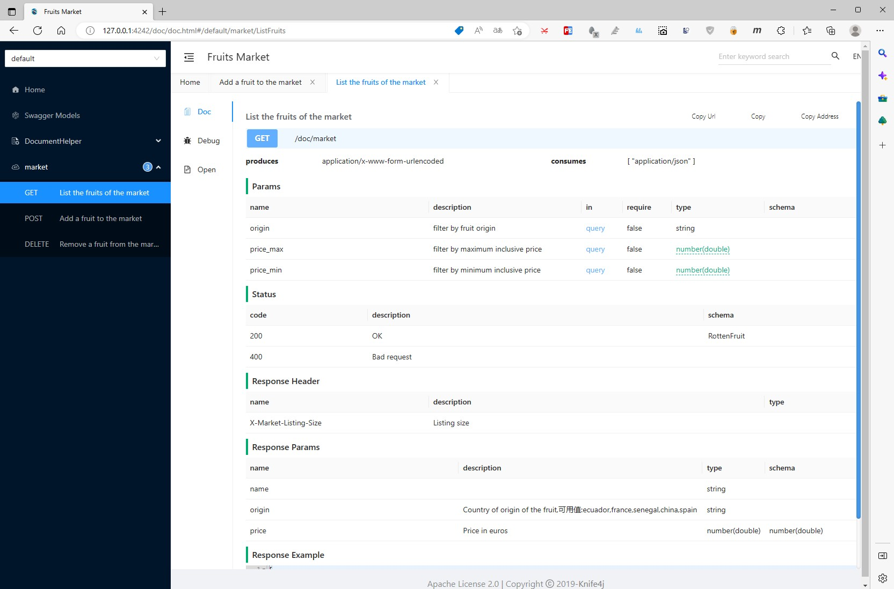

在[[wI2L/fizz: Gin wrapper with OpenAPI 3 spec generation (github.com)](https://github.com/wI2L/fizz)]的基础上，追加了UI。

主要是以下几点：

1. 参考了`springdoc`的处理方式，后续版本（如果使用的人多）可以尝试支持多个分组
2. 使用了针对swagger2和springdoc(openapi v3)的UI，即[[Knife4j Knife4j is a set of Swagger2 and OpenAPI3 All-in-one enhancement solution ](https://github.com/xiaoymin/knife4j)]的`knife4j-vue3`项目

开发时注意事项，因使用了`内嵌`静态资源文件的库，所以需要`golang 1.16`以上的支持。

更新`knife4j-vue3`时，只需要使用`npm`将编译后的`dist/`内容复制到本项目的`/ui/knife4go`下即可。

以下为示例图：

